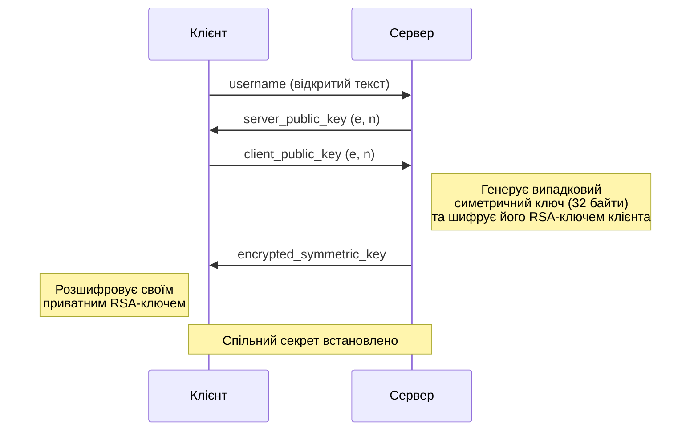
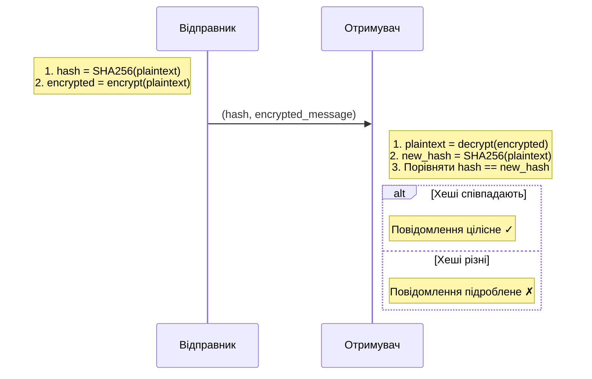

# Безпечний термінальний чат з RSA шифруванням

## Інструкції до запуску

### Вимоги
- Python 3.8+
- Додаткові бібліотеки **не потрібні** 

### Запуск

Потрібно відкрити **3 термінали** (PowerShell або CMD):

**Термінал 1 — Запуск сервера:**
```bash
cd "RSA implementation"
python server.py
```

**Термінал 2 — Запуск першого клієнта:**
```bash
cd "RSA implementation"
python client.py
```
> Введіть ім'я користувача (наприклад, `Alice Smith`)

**Термінал 3 — Запуск другого клієнта:**
```bash
cd "RSA implementation"
python client.py
```
> Введіть ім'я користувача (наприклад, `John Smith`)

Після підключення обох клієнтів, просто пишіть повідомлення — вони автоматично шифруються та перевіряються на цілісність.

---

## Коротке пояснення імплементації

### Структура проєкту

| Файл | Опис |
|------|------|
| `rsa_crypto.py` | Модуль криптографії: RSA, симетричне шифрування, хешування |
| `server.py` | Чат-сервер з обміном ключами та шифруванням |
| `client.py` | Чат-клієнт з обміном ключами та шифруванням |

### Алгоритм RSA (реалізований з нуля, без сторонніх бібліотек)

#### Генерація ключів:
1. Генеруємо два великих випадкових простих числа `p` і `q` (по 512 біт кожне)
2. Обчислюємо модуль: `n = p × q`
3. Обчислюємо функцію Ейлера: `φ(n) = (p-1)(q-1)`
4. Обираємо публічну експоненту: `e = 65537`
5. Обчислюємо приватну експоненту: `d = e⁻¹ mod φ(n)` (через розширений алгоритм Евкліда)

**Публічний ключ:** `(e, n)` — можна передавати відкрито
**Приватний ключ:** `(d, n)` — зберігається в секреті

#### Шифрування / Дешифрування:
- **Шифрування:** `c = m^e mod n` (де `m` — числове представлення повідомлення)
- **Дешифрування:** `m = c^d mod n`

#### Перевірка простоти:
Використовується **тест Міллера-Рабіна** з 20 раундами (ймовірність помилки < 10⁻¹²)

### Обмін ключами (Key Exchange)



### Шифрування повідомлень

Після обміну ключами, всі повідомлення шифруються **симетричним XOR-шифром** з використанням спільного секретного ключа (32 байти).

### Перевірка цілісності (Message Integrity)

Для кожного повідомлення використовується **SHA-256** хешування:



Це гарантує, що якщо зашифроване повідомлення було змінено під час передачі, отримувач це виявить.


---

## Матеріали

- [EverythingCrypto — збірка теорії по криптографії](https://github.com/zademn/EverythingCrypto)
- [Cryptography with Python — Hashing](https://medium.com/@ashiqgiga07/cryptography-with-python-hashing-d0b7dbf7767)
